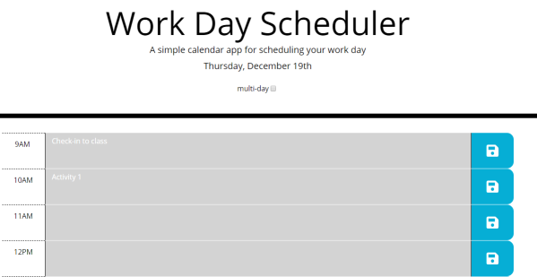

# Day Planner
## Purpose
Save your agenda for the work day.
* Support for business day (9am-5pm)
* Row shading to denote past, present, future time blocks

## Directions
Edit a row and click the save button to persist changes.
Time-blocks will be shaded according to when they happen
* Past - Grey
* Present - Red
* Future - Green
  
## Multi-day Support
* Check enable multi-day support.
* Use the calendar to select a day to view/edit.

## View the Site on GitHub Pages
[Day Planner](https://kgeary.github.io/third-party-apis/)

## Screenshot
